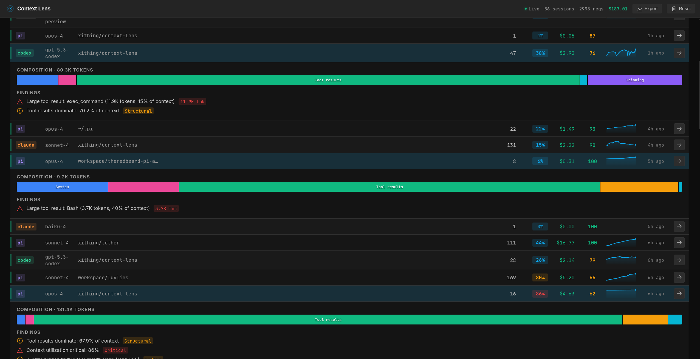
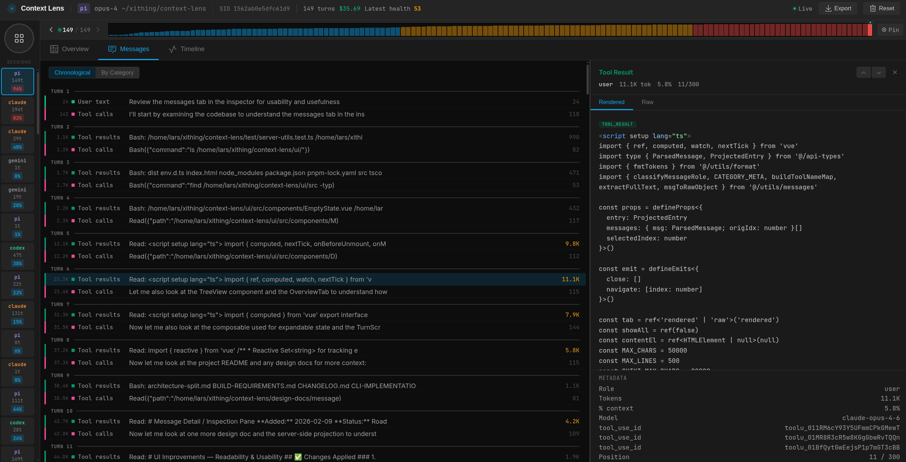
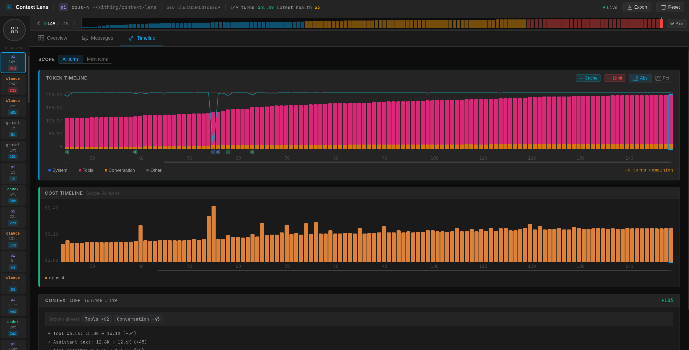

# Context Lens


[](https://github.com/larsderidder/context-lens/actions/workflows/ci.yml)
[](https://www.npmjs.com/package/context-lens)

See what's actually filling your context window. Context Lens is a local proxy that captures LLM API calls from your coding tools and shows you a composition breakdown: what percentage is system prompts, tool definitions, conversation history, tool results, thinking blocks. It answers the question every developer asks: "why is this session so expensive?"

Works with Claude Code, Codex, Gemini CLI, Aider, Pi, and anything else that talks to OpenAI/Anthropic/Google APIs. No code changes needed.


## Installation

```bash
npm install -g context-lens
# or: pnpm add -g context-lens
# or: npx context-lens ...
```

## Quick Start

```bash
context-lens claude
context-lens codex
context-lens gemini
context-lens aider --model claude-sonnet-4
context-lens pi
context-lens -- python my_agent.py
```

This starts the proxy (port 4040), opens the web UI (http://localhost:4041), sets the right env vars, and runs your command. Multiple tools can share one proxy; just open more terminals.

## CLI Options

```bash
context-lens --privacy=minimal claude   # minimal|standard|full
context-lens --no-open codex            # don't auto-open the UI
context-lens --no-ui -- claude          # proxy only, no UI
context-lens doctor                     # check ports, certs, background state
context-lens background start           # start detached proxy + UI
context-lens background status
context-lens background stop
```

Aliases: `cc` → `claude`, `cx` → `codex`, `cpi` → `pi`, `gm` → `gemini`.

## Docker

A pre-built image is published to GitHub Container Registry on every release:

```bash
docker run -d \
  -p 4040:4040 \
  -p 4041:4041 \
  -e CONTEXT_LENS_BIND_HOST=0.0.0.0 \
  -v ~/.context-lens:/root/.context-lens \
  ghcr.io/larsderidder/context-lens:latest
```

Or with Docker Compose (uses `~/.context-lens` on the host, so data is shared with any local install):

```bash
docker compose up -d
```

Then open http://localhost:4041 and point your tools at the proxy:

```bash
ANTHROPIC_BASE_URL=http://localhost:4040/claude claude
OPENAI_BASE_URL=http://localhost:4040 codex
```

### Environment variables

| Variable | Default | Description |
| :--- | :--- | :--- |
| `CONTEXT_LENS_BIND_HOST` | `127.0.0.1` | Set to `0.0.0.0` to accept connections from outside the container |
| `CONTEXT_LENS_INGEST_URL` | _(file-based)_ | POST captures to a remote URL instead of writing to disk |
| `CONTEXT_LENS_PRIVACY` | `standard` | Privacy level: `minimal`, `standard`, or `full` |
| `CONTEXT_LENS_NO_UPDATE_CHECK` | `0` | Set to `1` to skip the npm update check |

### Split-container setup

If you want to run the proxy and the analysis server as separate containers (no shared filesystem needed), set `CONTEXT_LENS_INGEST_URL` so the proxy POSTs captures directly to the analysis server over the Docker network:

```yaml
services:
  proxy:
    image: ghcr.io/larsderidder/context-lens:latest
    command: ["node", "dist/proxy/server.js"]
    ports:
      - "4040:4040"
    environment:
      CONTEXT_LENS_BIND_HOST: "0.0.0.0"
      CONTEXT_LENS_INGEST_URL: "http://analysis:4041/api/ingest"

  analysis:
    image: ghcr.io/larsderidder/context-lens:latest
    command: ["node", "dist/analysis/server.js"]
    ports:
      - "4041:4041"
    environment:
      CONTEXT_LENS_BIND_HOST: "0.0.0.0"
    volumes:
      - ~/.context-lens:/root/.context-lens
```

## Supported Providers

| Provider | Method | Status | Environment Variable |
| :--- | :--- | :--- | :--- |
| **Anthropic** | Reverse Proxy | ✅ Stable | `ANTHROPIC_BASE_URL` |
| **OpenAI** | Reverse Proxy | ✅ Stable | `OPENAI_BASE_URL` |
| **Google Gemini** | Reverse Proxy | 🧪 Experimental | `GOOGLE_GEMINI_BASE_URL` |
| **ChatGPT (Subscription)** | MITM Proxy | ✅ Stable | `https_proxy` |
| **Pi Coding Agent** | Reverse Proxy (temporary per-run config) | ✅ Stable | `PI_CODING_AGENT_DIR` (set by wrapper) |
| **OpenAI-Compatible** | Reverse Proxy | ✅ Stable | `UPSTREAM_OPENAI_URL` + `OPENAI_BASE_URL` |
| **Aider / Generic** | Reverse Proxy | ✅ Stable | Detects standard patterns |

## What You Get

- **Composition treemap:** visual breakdown of what's filling your context (system prompts, tool definitions, tool results, messages, thinking, images)
- **Cost tracking:** per-turn and per-session cost estimates across models
- **Conversation threading:** groups API calls by session, shows main agent vs subagent turns
- **Agent breakdown:** token usage and cost per agent within a session
- **Timeline:** bar chart of context size over time, filterable by main/all/cost
- **Context diff:** turn-to-turn delta showing what grew, shrank, or appeared
- **Findings:** flags large tool results, unused tool definitions, context overflow risk, compaction events
- **Auto-detection:** recognizes Claude Code, Codex, aider, Pi, and others by source tag or system prompt
- **LHAR export:** download session data as LHAR (LLM HTTP Archive) format ([doc](docs/LHAR.md))
- **State persistence:** data survives restarts; delete individual sessions or reset all from the UI
- **Streaming support:** passes through SSE chunks in real-time

### Screenshots

**Sessions list**



**Messages view with drill-down details**



**Timeline view**



**Findings panel**


## Advanced

Add a path prefix to tag requests by tool in the UI:

```bash
ANTHROPIC_BASE_URL=http://localhost:4040/claude claude
OPENAI_BASE_URL=http://localhost:4040/aider aider
```

### Pi Coding Agent

`context-lens pi` creates a temporary Pi config directory, symlinks your `~/.pi/agent/` files into it, and injects proxy URLs into a temporary `models.json`. Your real config is never modified and the temp directory is removed on exit.

If you prefer to configure it manually, set `baseUrl` in `~/.pi/agent/models.json`:

```json
{
  "providers": {
    "anthropic": { "baseUrl": "http://localhost:4040/pi" },
    "openai": { "baseUrl": "http://localhost:4040/pi" },
    "google-gemini-cli": { "baseUrl": "http://localhost:4040/pi" }
  }
}
```

### OpenAI-Compatible Endpoints

Many providers expose OpenAI-compatible APIs (OpenRouter, Together, Groq, Fireworks, Ollama, vLLM, OpenCode Zen, etc.). Override the upstream URL to point at your provider:

```bash
UPSTREAM_OPENAI_URL=https://opencode.ai/zen/v1 context-lens -- opencode "prompt"
```

`UPSTREAM_OPENAI_URL` is global: all OpenAI-format requests go to that upstream. Use separate proxy instances if you need to hit multiple endpoints simultaneously.

### Codex Subscription Mode

Codex with a ChatGPT subscription needs mitmproxy for HTTPS interception (Cloudflare blocks reverse proxies). The CLI handles this automatically. Just make sure `mitmdump` is installed:

```bash
pipx install mitmproxy
context-lens codex
```

If Codex fails with certificate trust errors, install/trust the mitmproxy CA certificate (`~/.mitmproxy/mitmproxy-ca-cert.pem`) for your environment.

## How It Works

Context Lens sits between your coding tool and the LLM API, capturing requests in transit. It has two parts: a **proxy** and an **analysis server**.

```
Tool  ─HTTP─▶  Proxy (:4040)  ─HTTPS─▶  api.anthropic.com / api.openai.com
                    │
              capture files
                    │
            Analysis Server (:4041)  →  Web UI
```

The **proxy** forwards requests to the LLM API and writes each request/response pair to disk. It has **zero external dependencies** (only Node.js built-ins), so you can read the entire proxy source and verify it does nothing unexpected with your API keys.

The **analysis server** picks up those captures, parses request bodies, estimates tokens, groups requests into conversations, computes composition breakdowns, calculates costs, and scores context health. It serves the web UI and API.

The CLI sets env vars like `ANTHROPIC_BASE_URL=http://localhost:4040` so the tool sends requests to the proxy instead of the real API. The tool never knows it's being proxied.

## Why Context Lens?

Tools like [Langfuse](https://langfuse.com/) and [Braintrust](https://braintrust.dev/) are great for observability when you control the code: you add their SDK, instrument your calls, and get traces in a dashboard. Context Lens solves a different problem.

**You can't instrument tools you don't own.** Claude Code, Codex, Gemini CLI, and Aider are closed-source binaries. You can't add an SDK to them. Context Lens works as a transparent proxy, so it captures everything without touching the tool's code.

**Context composition, not just token counts.** Most observability tools show you input/output token totals. Context Lens breaks down *what's inside* the context window: how much is system prompts vs. tool definitions vs. conversation history vs. tool results vs. thinking blocks. That's what you need to understand why sessions get expensive.

**Local and private.** Everything runs on your machine. No accounts, no cloud, no data leaving your network. Start it, use it, stop it.

| | Context Lens | Langfuse / Braintrust |
|:---|:---|:---|
| **Setup** | `context-lens claude` | Add SDK, configure API keys |
| **Works with closed-source tools** | Yes (proxy) | No (needs instrumentation) |
| **Context composition breakdown** | Yes (treemap, per-category) | Token totals only |
| **Runs locally** | Yes, entirely | Cloud or self-hosted server |
| **Prompt management & evals** | No | Yes |
| **Team/production use** | No (single-user, local) | Yes |

Context Lens is for developers who want to understand and optimize their coding agent sessions. If you need production monitoring, prompt versioning, or team dashboards, use Langfuse.

## Data

Captured requests are kept in memory (last 200 sessions) and persisted to `~/.context-lens/data/state.jsonl` across restarts. Each session is also logged as a separate `.lhar` file in `~/.context-lens/data/`. Use the Reset button in the UI to clear everything.

## License

MIT
