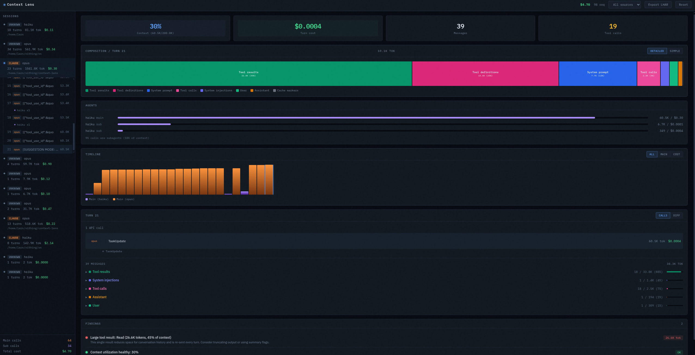

# Context Lens


See what's actually in your LLM's context window. A zero-dependency HTTP proxy that intercepts API calls and visualizes token usage in real-time.



## Quick Start

```bash
npx context-lens claude "your prompt"
npx context-lens codex "your prompt"
npx context-lens aider --model claude-sonnet-4
npx context-lens -- python my_agent.py
```

This starts the proxy (port 4040), opens the web UI (http://localhost:4041), sets the right env vars, and runs your command. Multiple tools can share one proxy — just open more terminals.

## What You Get

- **Composition treemap** — visual breakdown of what's filling your context: system prompts, tool definitions, tool results, messages, thinking, images
- **Cost tracking** — per-turn and per-session cost estimates across models
- **Conversation threading** — groups API calls by session, shows main agent vs subagent turns
- **Agent breakdown** — token usage and cost per agent within a session
- **Timeline** — bar chart of context size over time, filterable by main/all/cost
- **Context diff** — turn-to-turn delta showing what grew, shrank, or appeared
- **Findings** — flags large tool results, unused tool definitions, context overflow risk, compaction events
- **Auto-detection** — recognizes Claude Code, Codex, aider, and others by source tag or system prompt
- **LHAR export** — download session data as LHAR (LLM HTTP Archive) format
- **State persistence** — data survives restarts; delete individual sessions or reset all from the UI
- **Streaming support** — passes through SSE chunks in real-time

## Manual Mode

```bash
npm start
# Port 4040 = proxy, port 4041 = web UI

ANTHROPIC_BASE_URL=http://localhost:4040 claude "your prompt"
OPENAI_BASE_URL=http://localhost:4040 codex "your prompt"
```

### Source Tagging

Add a path prefix to tag requests by tool:

```bash
ANTHROPIC_BASE_URL=http://localhost:4040/claude claude "prompt"
OPENAI_BASE_URL=http://localhost:4040/aider aider "prompt"
```

### Codex Subscription Mode

Codex with a ChatGPT subscription needs mitmproxy for HTTPS interception (Cloudflare blocks reverse proxies). The CLI handles this automatically — just make sure `mitmdump` is installed:

```bash
pipx install mitmproxy
npx context-lens codex "your prompt"
```

## Data

Captured requests are kept in memory (last 100) and persisted to `data/state.jsonl` across restarts. Each session is also logged as a separate `.lhar` file in `data/`. Use the Reset button in the UI to clear everything.

## License

MIT
