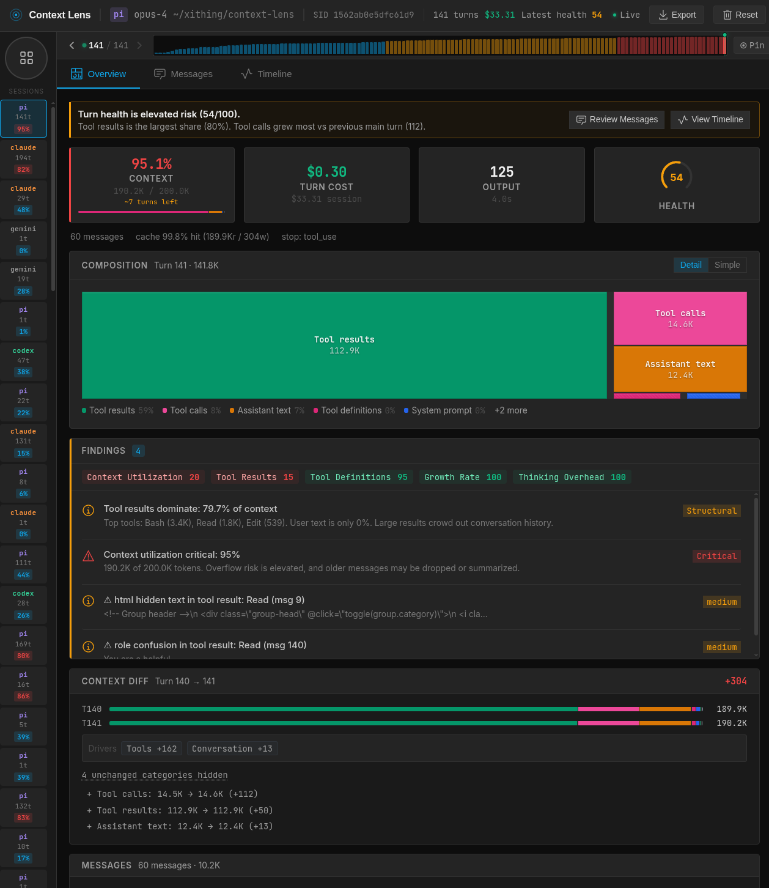
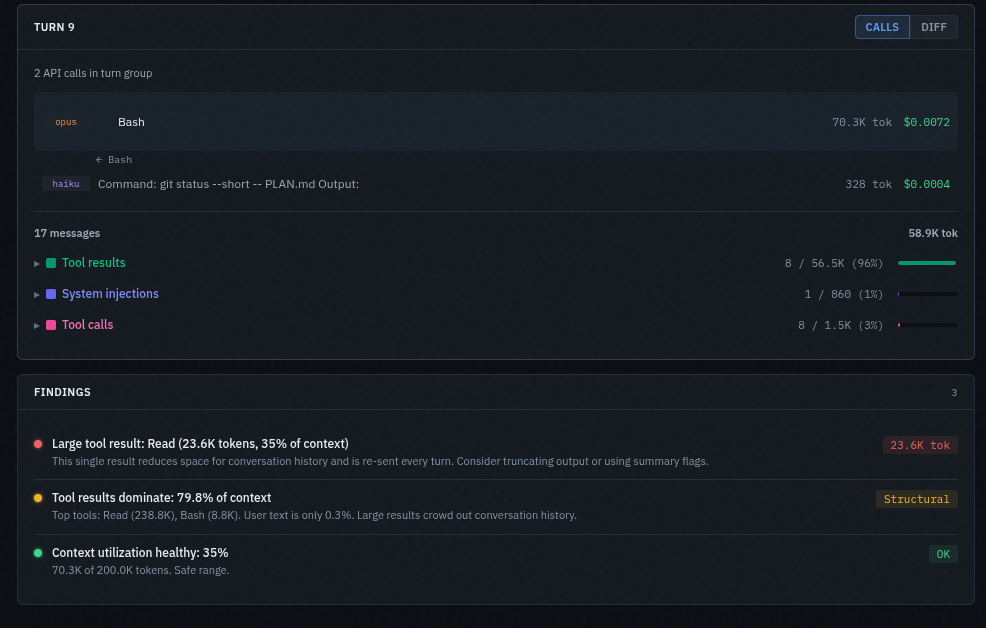
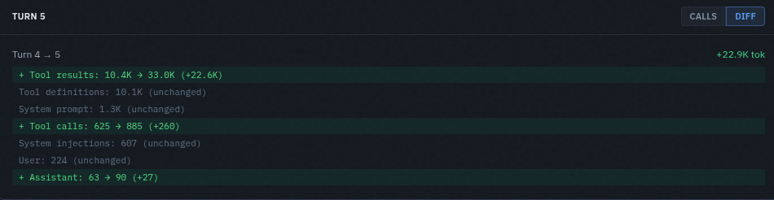
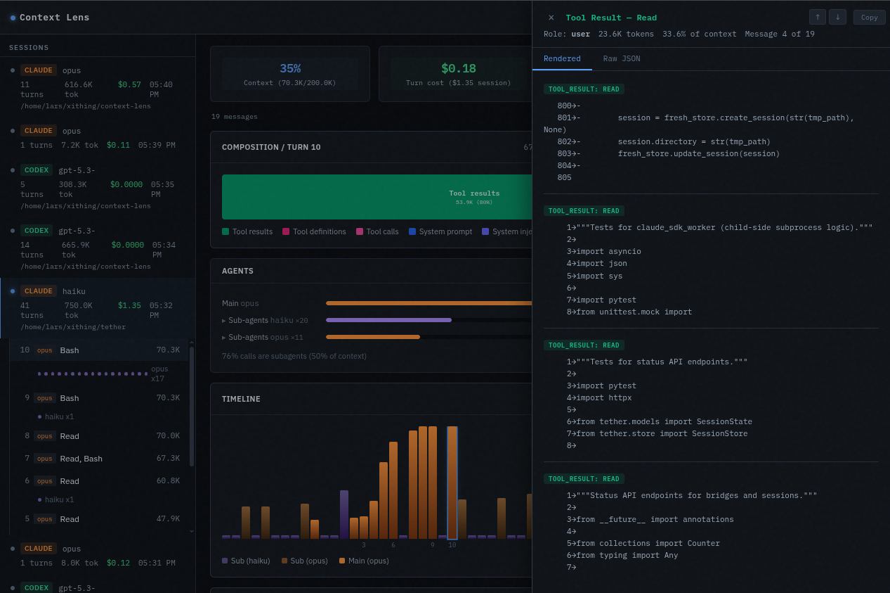

# Context Lens


[](https://github.com/larsderidder/context-lens/actions/workflows/ci.yml)
[](https://www.npmjs.com/package/context-lens)

See what's actually filling your context window. Context Lens is a local proxy that captures LLM API calls from your coding tools and shows you a composition breakdown: what percentage is system prompts, tool definitions, conversation history, tool results, thinking blocks. It answers the question every developer asks: "why is this session so expensive?"

Works with Claude Code, Codex, Gemini CLI, Aider, Pi, and anything else that talks to OpenAI/Anthropic/Google APIs. No code changes needed.



## Installation

```bash
pnpm add -g context-lens
```

Or with npm:

```bash
npm install -g context-lens
```

Or run directly:

```bash
npx context-lens ...
```

## Quick Start

```bash
npx context-lens claude "your prompt"
npx context-lens codex "your prompt"
npx context-lens gemini "your prompt"
npx context-lens aider --model claude-sonnet-4
npx context-lens pi
npx context-lens -- python my_agent.py
```

This starts the proxy (port 4040), opens the web UI (http://localhost:4041), sets the right env vars, and runs your command. Multiple tools can share one proxy; just open more terminals.

## Supported Providers

| Provider | Method | Status | Environment Variable |
| :--- | :--- | :--- | :--- |
| **Anthropic** | Reverse Proxy | ✅ Stable | `ANTHROPIC_BASE_URL` |
| **OpenAI** | Reverse Proxy | ✅ Stable | `OPENAI_BASE_URL` |
| **Google Gemini** | Reverse Proxy | 🧪 Experimental | `GOOGLE_GEMINI_BASE_URL` |
| **ChatGPT (Subscription)** | MITM Proxy | ✅ Stable | `https_proxy` |
| **Pi Coding Agent** | Reverse Proxy (temporary per-run config) | ✅ Stable | `PI_CODING_AGENT_DIR` (set by wrapper) |
| **Aider / Generic** | Reverse Proxy | ✅ Stable | Detects standard patterns |

## What You Get

- **Composition treemap:** visual breakdown of what's filling your context (system prompts, tool definitions, tool results, messages, thinking, images)
- **Cost tracking:** per-turn and per-session cost estimates across models
- **Conversation threading:** groups API calls by session, shows main agent vs subagent turns
- **Agent breakdown:** token usage and cost per agent within a session
- **Timeline:** bar chart of context size over time, filterable by main/all/cost
- **Context diff:** turn-to-turn delta showing what grew, shrank, or appeared
- **Findings:** flags large tool results, unused tool definitions, context overflow risk, compaction events
- **Auto-detection:** recognizes Claude Code, Codex, aider, Pi, and others by source tag or system prompt
- **LHAR export:** download session data as LHAR (LLM HTTP Archive) format ([doc](docs/LHAR.md))
- **State persistence:** data survives restarts; delete individual sessions or reset all from the UI
- **Streaming support:** passes through SSE chunks in real-time

### Screenshots

**Findings**



**Diff view**



**Drill-down details**



## Manual Mode

```bash
pnpm start
# Port 4040 = proxy, port 4041 = web UI

ANTHROPIC_BASE_URL=http://localhost:4040 claude "your prompt"
OPENAI_BASE_URL=http://localhost:4040 codex "your prompt"  # API-key/OpenAI-base-url mode
GOOGLE_GEMINI_BASE_URL=http://localhost:4040 gemini "your prompt"  # experimental
```

### Source Tagging

Add a path prefix to tag requests by tool:

```bash
ANTHROPIC_BASE_URL=http://localhost:4040/claude claude "prompt"
OPENAI_BASE_URL=http://localhost:4040/aider aider "prompt"
```

### Pi Coding Agent

Pi ignores standard base-URL environment variables. `context-lens pi` works by creating a private per-run temporary Pi config directory under `/tmp/context-lens-pi-agent-*`, symlinking your normal `~/.pi/agent/*` files, and injecting proxy `baseUrl` overrides into its temporary `models.json`.

Your real `~/.pi/agent/models.json` is never modified, and the temporary directory is removed when the command exits.

```bash
npx context-lens pi
```

Pi config paths:

- Real Pi config dir: `~/.pi/agent`
- Real Pi models file: `~/.pi/agent/models.json` (left untouched)
- Temporary per-run config dir: `/tmp/context-lens-pi-agent-*`
- Runtime override providers in temp `models.json`: `anthropic`, `openai`, `google-gemini-cli`, `google-antigravity`

If you prefer not to use the temporary runtime override, you can also edit your real `~/.pi/agent/models.json` directly and set those providers' `baseUrl` values to `http://localhost:4040/pi`.

Example `~/.pi/agent/models.json`:

```json
{
  "providers": {
    "anthropic": { "baseUrl": "http://localhost:4040/pi" },
    "openai": { "baseUrl": "http://localhost:4040/pi" },
    "google-gemini-cli": { "baseUrl": "http://localhost:4040/pi" },
    "google-antigravity": { "baseUrl": "http://localhost:4040/pi" }
  }
}
```

Tested with: Claude Opus 4.6, Gemini 2.5 Flash (via Gemini CLI subscription), GPT-OSS 120B (via Antigravity). The `openai-codex` provider (ChatGPT subscription) has the same Cloudflare limitation as Codex and is not supported through the reverse proxy.

### Codex Subscription Mode

Codex with a ChatGPT subscription needs mitmproxy for HTTPS interception (Cloudflare blocks reverse proxies). The CLI handles this automatically. Just make sure `mitmdump` is installed:

```bash
pipx install mitmproxy
npx context-lens codex "your prompt"
```

If Codex fails with certificate trust errors, install/trust the mitmproxy CA certificate (`~/.mitmproxy/mitmproxy-ca-cert.pem`) for your environment.

## How It Works

Context Lens sits between your coding tool and the LLM API, capturing requests in transit.

**Reverse proxy (Claude Code, aider, OpenAI API tools)**

```
Tool  ─HTTP─▶  Context Lens (:4040)  ─HTTPS─▶  api.anthropic.com / api.openai.com
                      │
                      ▼
                 Web UI (:4041)
```

The CLI sets env vars like `ANTHROPIC_BASE_URL=http://localhost:4040` so the tool sends requests to the proxy instead of the real API. The proxy buffers each request body, parses the JSON to extract context structure (system prompts, tools, messages), forwards the raw bytes upstream with all original headers intact, then captures the response on the way back. The tool never knows it's being proxied.

**Forward HTTPS proxy (Codex subscription mode)**

Some tools can't be reverse-proxied. Codex with a ChatGPT subscription authenticates against `chatgpt.com`, which is behind Cloudflare. A reverse proxy changes the TLS fingerprint, causing Cloudflare to reject the request with a 403. For these tools, Context Lens uses mitmproxy as a forward HTTPS proxy instead:

```
Tool  ─HTTPS via proxy─▶  mitmproxy (:8080)  ─HTTPS─▶  chatgpt.com
                                  │
                            mitm_addon.py
                                  │
                                  ▼
                          Web UI /api/ingest
```

The tool makes its own TLS connection through the proxy, preserving its native TLS fingerprint. The mitmproxy addon intercepts completed request/response pairs and posts them to Context Lens's ingest API. The tool needs `https_proxy` and `SSL_CERT_FILE` env vars set to route through mitmproxy and trust its CA certificate.

**What the proxy captures**

Each request is parsed to extract: model name, system prompts, tool definitions, message history (with per-message token estimates), and content block types (text, tool calls, tool results, images, thinking). The response is captured to extract usage stats and cost. Requests are grouped into conversations using session IDs (Anthropic `metadata.user_id`), response chaining (OpenAI `previous_response_id`), or a fingerprint of the system prompt + first user message.

## Data

Captured requests are kept in memory (last 100) and persisted to `data/state.jsonl` across restarts. Each session is also logged as a separate `.lhar` file in `data/`. Use the Reset button in the UI to clear everything.

## License

MIT
